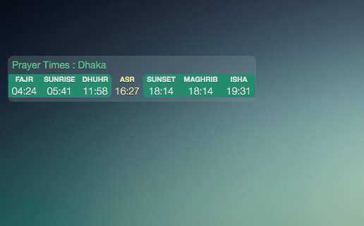

prayer-time-widget
==========================

A simple [Übersicht](http://tracesof.net/uebersicht/) widget. This will enable a simple yet beautiful daily muslim prayer time-table with current prayer highlighted on your desktop to make it more useful.

## Screenshot

## Download

To download just the zipped widget folder, check out [the latest release](https://github.com/ashikahmad/prayer-time-widget/releases/latest).

## Contributing

Have an idea for improving this widget? [Open an issue](https://github.com/ashikahmad/prayer-time-widget/issues/new) or fork this repository and send a pull request :grinning:.

If you want to contribute, having a go at one of these items above might be a good place to start! :+1:

## License

[CC0 1.0 Universal](./LICENSE)